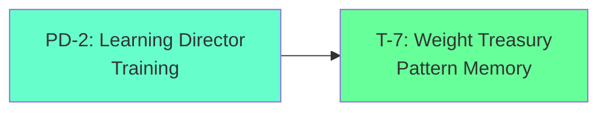
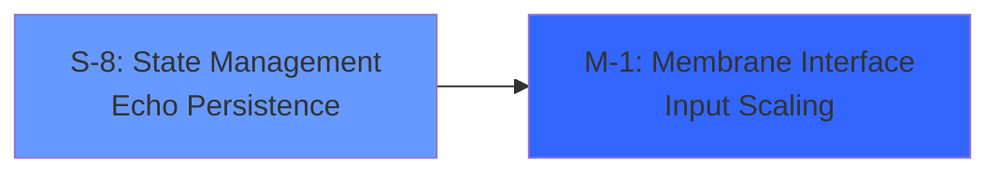

# cosys-esn

## Cosmos System Model Applied to Reservoir Membrane Computing & Echo State Networks

This repository implements the **Cosmos System 5** triadic architecture mapped to reservoir computing, echo state networks (ESNs), and membrane computing paradigms, providing a comprehensive framework for understanding and modeling recurrent neural dynamics through organizational systems theory.

---

## Overview

**cosys-esn** translates the Cosmos System's triadic polarity structure into a reservoir computing model that treats echo state networks as self-organizing cognitive systems. The framework implements the **18-service [[D-T]-[P-O]-[S-M]] pattern** mapped to reservoir dynamics, membrane operations, and temporal processing.

### Core Mapping: Reservoir as Cognitive Triad

```
┌─────────────────────────────────────────────────────────────────────────────┐
│                    COSYS-ESN: RESERVOIR COSMOS SYSTEM                       │
├─────────────────────────────────────────────────────────────────────────────┤
│                                                                             │
│   ┌─────────────────────────────────────────────────────────────────────┐   │
│   │                    CEREBRAL TRIAD [3]                               │   │
│   │                    Output Layer - Readout Functions                 │   │
│   │                    Potential Topology                               │   │
│   ├─────────────────────────────────────────────────────────────────────┤   │
│   │  T-7: Weight Treasury       │  PD-2: Learning Director             │   │
│   │  Output Weight Storage      │  Training Coordination               │   │
│   │  Pattern Memory             │  Gradient Management                 │   │
│   ├────────────────────────────┼────────────────────────────────────────┤   │
│   │  P-5: Readout Processing   │  O-4: Output Organization             │   │
│   │  Linear Combination        │  Signal Structuring                   │   │
│   │  Feature Extraction        │  Response Formatting                  │   │
│   └─────────────────────────────────────────────────────────────────────┘   │
│                                    │                                        │
│                                    ▼                                        │
│   ┌─────────────────────────────────────────────────────────────────────┐   │
│   │                    SOMATIC TRIAD [6]                                │   │
│   │                    Reservoir Layer - Recurrent Dynamics             │   │
│   │                    Commitment Topology                              │   │
│   ├─────────────────────────────────────────────────────────────────────┤   │
│   │  M-1: Membrane Interface    │  S-8: State Management               │   │
│   │  Input Scaling              │  Reservoir State Vector              │   │
│   │  Boundary Conditions        │  Echo Persistence                    │   │
│   ├────────────────────────────┼────────────────────────────────────────┤   │
│   │  P-5: Recurrent Processing │  O-4: Dynamics Organization           │   │
│   │  Nonlinear Transformation  │  Spectral Radius Control              │   │
│   │  Sparse Connectivity       │  Leak Rate Management                 │   │
│   └─────────────────────────────────────────────────────────────────────┘   │
│                                    │                                        │
│                                    ▼                                        │
│   ┌─────────────────────────────────────────────────────────────────────┐   │
│   │                    AUTONOMIC TRIAD [9]                              │   │
│   │                    Input Layer - Preprocessing Functions            │   │
│   │                    Performance Topology                             │   │
│   ├─────────────────────────────────────────────────────────────────────┤   │
│   │  M-1: Input Monitoring      │  S-8: Signal State                   │   │
│   │  Input Validation           │  Buffer Management                   │   │
│   │  Noise Detection            │  Temporal Windowing                  │   │
│   ├────────────────────────────┼────────────────────────────────────────┤   │
│   │  PD-2: Preprocessing Dir   │  T-7: Encoding Triggers               │   │
│   │  Normalization              │  Feature Extraction                  │   │
│   │  Dimensionality Reduction  │  Sparse Coding                        │   │
│   ├────────────────────────────┼────────────────────────────────────────┤   │
│   │  P-5: Transform Processing │                                       │   │
│   │  Fourier/Wavelet           │                                       │   │
│   │  Embedding Generation      │                                       │   │
│   └─────────────────────────────────────────────────────────────────────┘   │
│                                                                             │
└─────────────────────────────────────────────────────────────────────────────┘
```

---

## Theoretical Foundation

### Echo State Property

The fundamental principle of ESNs is the **echo state property**: the reservoir's internal state asymptotically depends only on the input history, not on initial conditions. This maps to the Cosmos System's **performance topology** where past inputs echo through the system.

$$\mathbf{x}(t+1) = (1-\alpha)\mathbf{x}(t) + \alpha \cdot f(\mathbf{W}_{in}\mathbf{u}(t+1) + \mathbf{W}\mathbf{x}(t))$$

Where:
- $\mathbf{x}(t)$ = Reservoir state (S-8: State Management)
- $\mathbf{u}(t)$ = Input signal (M-1: Membrane Interface)
- $\mathbf{W}$ = Recurrent weights (P-5: Recurrent Processing)
- $\mathbf{W}_{in}$ = Input weights (M-1: Input Monitoring)
- $\alpha$ = Leak rate (O-4: Dynamics Organization)
- $f$ = Activation function (P-5: Nonlinear Transformation)

### Membrane Computing Paradigm

Inspired by biological membranes, the reservoir operates as a **P-system** with:

| Membrane Layer | Cosmos Triad | Function |
|---------------|--------------|----------|
| **Skin Membrane** | Autonomic | Input/output boundary |
| **Elementary Membrane** | Somatic | Reservoir compartments |
| **Nucleus Membrane** | Cerebral | Readout coordination |

### Edge-of-Chaos Dynamics

The reservoir operates at the **edge of chaos** where:
- **Spectral radius** ≈ 1.0 (critical point)
- Maximum **information processing capacity**
- Balance between **stability** and **sensitivity**

This maps to the Cosmos System's **commitment topology** where the system commits to processing while maintaining adaptability.

---

## System 5 Reservoir State Machine

### The 60-Step Echo Cycle

The reservoir operates on a **60-step deterministic cycle** (LCM of 3 and 20) representing the synchronization of echo dynamics:

```python
class ReservoirSystem5:
    """
    Implements the 60-step reservoir cycle with triadic dynamics.
    """
    
    def __init__(self, n_reservoir: int = 1000):
        # Universal Sets: Global Reservoir Modes
        self.U1 = ExplorationMode()      # High spectral radius
        self.U2 = ExploitationMode()     # Stable dynamics
        self.U3 = AdaptationMode()       # Learning phase
        
        # Particular Sets: Reservoir Compartments
        self.P1 = InputCompartment()     # Input processing
        self.P2 = CoreReservoir()        # Main dynamics
        self.P3 = MemoryCompartment()    # Long-term echo
        self.P4 = OutputCompartment()    # Readout preparation
        
        # Reservoir parameters
        self.W = self._initialize_reservoir(n_reservoir)
        self.W_in = self._initialize_input_weights()
        self.W_out = None  # Trained during learning
        
    def echo_step(self, u: np.ndarray, t: int) -> np.ndarray:
        """Execute one step of the 60-step echo cycle."""
        # Universal mode transition (3-step cycle)
        u_idx = t % 3
        mode = self.get_mode(u_idx)
        
        # Adjust spectral radius based on mode
        spectral_radius = {0: 0.95, 1: 0.85, 2: 0.90}[u_idx]
        
        # Particular compartment transition (5-step staggered)
        p_idx = t % 5
        if p_idx < 4:
            compartment = [self.P1, self.P2, self.P3, self.P4][p_idx]
            return compartment.process(u, self.x, spectral_radius)
        
        # Rest step: consolidation
        return self.consolidate_echo()
```

### Nested Concurrency in Reservoirs

The **convolution of concurrency** implements parallel echo processing:

$$S_{compartment}(t+1) = (S_{compartment}(t) + \sum_{other} S_{other}(t) + Mode_{phase}(t)) \mod 4$$

This captures reservoir interdependencies where:
- Input compartment affects core reservoir
- Core reservoir affects memory compartment
- Memory compartment affects output compartment
- All compartments influenced by global mode

---

## The 18-Service [[D-T]-[P-O]-[S-M]] Pattern for ESN

### Complete Reservoir Service Mapping

```
                    D-T         P-O         S-M         Total
Cerebral (Output)   2           2           2           = 6
Somatic (Reservoir) 2*          2           2           = 6  
Autonomic (Input)   2*          2           2           = 6
                    ────────────────────────────────────────
Total:              6           6           6           = 18

*Parasympathetic Polarity [D-T] shared between Somatic and Autonomic
```

### Cerebral Triad Services (Output Layer)

| Service | Code | Function | ESN Role |
|---------|------|----------|----------|
| **Development** | PD-2 | Learning Director | Ridge regression, gradient descent |
| **Treasury** | T-7 | Weight Treasury | Output weight storage, pattern memory |
| **Production** | P-5 | Readout Processing | Linear combination, feature extraction |
| **Organization** | O-4 | Output Organization | Signal structuring, response formatting |
| **Sales** | S-8 | Output Delivery | Prediction generation, classification |
| **Market** | M-1 | Target Interface | Loss computation, feedback reception |

### Somatic Triad Services (Reservoir Layer)

| Service | Code | Function | ESN Role |
|---------|------|----------|----------|
| **Development** | PD-2 | Dynamics Development* | Spectral tuning, topology optimization |
| **Treasury** | T-7 | State Treasury* | Echo memory, temporal patterns |
| **Production** | P-5 | Recurrent Processing | Nonlinear transformation, sparse connectivity |
| **Organization** | O-4 | Dynamics Organization | Spectral radius control, leak rate |
| **Sales** | S-8 | State Management | Reservoir state vector, echo persistence |
| **Market** | M-1 | Membrane Interface | Input scaling, boundary conditions |

### Autonomic Triad Services (Input Layer)

| Service | Code | Function | ESN Role |
|---------|------|----------|----------|
| **Development** | PD-2 | Preprocessing Director* | Normalization, dimensionality reduction |
| **Treasury** | T-7 | Encoding Triggers | Feature extraction, sparse coding |
| **Production** | P-5 | Transform Processing | Fourier/wavelet, embedding generation |
| **Organization** | O-4 | Input Organization | Temporal windowing, batching |
| **Sales** | S-8 | Signal State | Buffer management, sequence handling |
| **Market** | M-1 | Input Monitoring | Input validation, noise detection |

---

## Dimensional Flow Architecture

### Commitment Dimension [5-4]: Processing → Organization
**Reservoir Flow**: Nonlinear Transformation → Dynamics Control


**Characteristics**:
- Activation function application
- Spectral radius enforcement
- Commitment to stable dynamics
- Edge-of-chaos maintenance

### Potential Dimension [2-7]: Development → Treasury
**Reservoir Flow**: Learning → Weight Storage



**Characteristics**:
- Ridge regression training
- Output weight optimization
- Potential pattern storage
- Memory consolidation

### Performance Dimension [8-1]: State → Membrane
**Reservoir Flow**: Echo Persistence → Input Interface



**Characteristics**:
- State-dependent input scaling
- Adaptive boundary conditions
- Performance feedback loop
- Echo-input coupling

---

## EchoBeats: 12-Step Cognitive Loop

Based on the NNECCO architecture, cosys-esn implements a **12-step cognitive loop** with three concurrent streams:

### The 12-Step Cycle

| Step | Phase | Stream 1 | Stream 2 | Stream 3 |
|------|-------|----------|----------|----------|
| 1 | PERCEIVE | Input | Reflect | Act |
| 2 | ATTEND | Input | Reflect | Act |
| 3 | FRAME | Input | Reflect | Act |
| 4 | REASON | Reflect | Act | Input |
| 5 | PERCEIVE | Reflect | Act | Input |
| 6 | INTEND | Reflect | Act | Input |
| 7 | PERCEIVE | Act | Input | Reflect |
| 8 | EXECUTE | Act | Input | Reflect |
| 9 | PERCEIVE | Act | Input | Reflect |
| 10 | EVALUATE | Input | Reflect | Act |
| 11 | PERCEIVE | Input | Reflect | Act |
| 12 | INTEGRATE | Input | Reflect | Act |

### Three Concurrent Echo Streams

```python
class EchoBeatsProcessor:
    """
    Implements 3 concurrent echo streams with 12-step interleaving.
    """
    
    def __init__(self, reservoir: ReservoirSystem5):
        self.reservoir = reservoir
        self.streams = [
            EchoStream(phase_offset=0),   # Stream 1: Primary
            EchoStream(phase_offset=4),   # Stream 2: 120° offset
            EchoStream(phase_offset=8),   # Stream 3: 240° offset
        ]
        
    def process_cycle(self, input_sequence: np.ndarray) -> np.ndarray:
        """
        Process input through 12-step cognitive loop.
        """
        outputs = []
        
        for step in range(12):
            # Determine active phases for each stream
            phases = [
                self.get_phase(step, stream.phase_offset)
                for stream in self.streams
            ]
            
            # Process each stream
            stream_outputs = []
            for i, (stream, phase) in enumerate(zip(self.streams, phases)):
                if phase == 'PERCEIVE':
                    stream_outputs.append(stream.perceive(input_sequence[step]))
                elif phase == 'REASON':
                    stream_outputs.append(stream.reason(self.reservoir))
                elif phase == 'EXECUTE':
                    stream_outputs.append(stream.execute())
                # ... other phases
                    
            # Integrate stream outputs
            outputs.append(self.integrate_streams(stream_outputs))
            
        return np.array(outputs)
```

### Stream Interleaving Pattern

The three streams are phased **120 degrees apart** (4 steps in 12-step cycle):

```
Step:    1  2  3  4  5  6  7  8  9  10 11 12
Stream1: P  A  F  R  P  I  P  E  P  Ev P  In
Stream2: R  P  I  P  E  P  Ev P  In P  A  F
Stream3: E  P  Ev P  In P  A  F  R  P  I  P

P=Perceive, A=Attend, F=Frame, R=Reason, I=Intend, E=Execute, Ev=Evaluate, In=Integrate
```

---

## Reservoir Autognosis

### Self-Aware Reservoir System

The reservoir implements **hierarchical self-monitoring** through:

#### Self-Monitoring Layer
- **State Norm Tracking**: ||x(t)|| monitoring
- **Spectral Analysis**: Eigenvalue distribution
- **Echo Index**: Fading memory measurement
- **Activation Statistics**: Mean, variance, sparsity

#### Self-Modeling Layer
- **Capacity Estimation**: Information processing capacity
- **Kernel Quality**: Separation vs. approximation
- **Memory Depth**: Effective echo horizon
- **Nonlinearity Profile**: Activation distribution

#### Meta-Cognitive Layer
- **Performance Prediction**: Expected accuracy estimation
- **Confidence Scoring**: Prediction uncertainty
- **Anomaly Detection**: Out-of-distribution inputs
- **Adaptation Triggers**: When to retrain

#### Self-Optimization Layer
- **Spectral Radius Tuning**: Adaptive edge-of-chaos
- **Leak Rate Adaptation**: Task-dependent memory
- **Input Scaling Optimization**: Signal-to-noise balance
- **Topology Refinement**: Connectivity patterns

```python
class ReservoirAutognosis:
    """
    Self-awareness system for echo state networks.
    """
    
    def __init__(self, reservoir: ReservoirSystem5):
        self.reservoir = reservoir
        self.metrics_history = []
        
    def monitor(self) -> Dict[str, float]:
        """Monitor reservoir health metrics."""
        x = self.reservoir.get_state()
        W = self.reservoir.W
        
        return {
            'state_norm': np.linalg.norm(x),
            'spectral_radius': self._compute_spectral_radius(W),
            'echo_index': self._compute_echo_index(),
            'sparsity': np.mean(np.abs(x) < 0.1),
            'activation_mean': np.mean(x),
            'activation_var': np.var(x),
        }
        
    def assess_capacity(self) -> float:
        """Estimate information processing capacity."""
        # Memory capacity + nonlinear capacity
        mc = self._compute_memory_capacity()
        nc = self._compute_nonlinear_capacity()
        return mc + nc
        
    def should_adapt(self) -> bool:
        """Determine if reservoir needs adaptation."""
        recent_metrics = self.metrics_history[-10:]
        
        # Check for degradation patterns
        norm_trend = np.polyfit(range(10), [m['state_norm'] for m in recent_metrics], 1)[0]
        
        return abs(norm_trend) > 0.1  # Significant drift
```

---

## Reservoir Ontogenesis

### Self-Generating Reservoir Kernels

Reservoirs evolve through **self-generating kernels** using B-series expansion:

```python
class ReservoirKernelGenome:
    """
    Evolutionary genome for reservoir configurations.
    """
    
    def __init__(self):
        self.genes = {
            'n_neurons': IntGene(100, 2000),
            'spectral_radius': FloatGene(0.8, 1.0),
            'input_scaling': FloatGene(0.1, 1.0),
            'leak_rate': FloatGene(0.1, 1.0),
            'sparsity': FloatGene(0.8, 0.99),
            'activation': CategoricalGene(['tanh', 'relu', 'sigmoid']),
            'topology': CategoricalGene(['random', 'small_world', 'scale_free']),
        }
        self.fitness = 0.0
        self.generation = 0
        
    def mutate(self, rate: float = 0.1):
        """Apply random mutations to genome."""
        for gene in self.genes.values():
            if np.random.random() < rate:
                gene.mutate()
                
    def crossover(self, other: 'ReservoirKernelGenome') -> 'ReservoirKernelGenome':
        """Create offspring through crossover."""
        child = ReservoirKernelGenome()
        for key in self.genes:
            if np.random.random() < 0.5:
                child.genes[key] = self.genes[key].copy()
            else:
                child.genes[key] = other.genes[key].copy()
        return child
```

### B-Series Reservoir Expansion

Using elementary differentials (A000081 sequence) for reservoir dynamics:

```python
def b_series_reservoir_expansion(order: int, domain_spec: Dict) -> ReservoirKernel:
    """
    Generate reservoir kernel using B-series expansion.
    
    The elementary differentials represent computation trees
    that map to reservoir connectivity patterns.
    """
    # Elementary differentials up to given order
    trees = elementary_differentials(order)
    
    # Butcher weights for domain-specific kernel
    weights = compute_butcher_weights(domain_spec)
    
    # Generate reservoir connectivity from trees
    connectivity = []
    for tree, weight in zip(trees, weights):
        pattern = tree_to_connectivity_pattern(tree)
        connectivity.append((pattern, weight))
        
    return ReservoirKernel(connectivity)
```

---

## Implementation

### Directory Structure
```
cosys-esn/
├── README.md
├── ARCHITECTURE.md
├── RESERVOIR_DYNAMICS.md
├── src/
│   ├── cerebral-triad/
│   │   ├── weight-treasury/          # T-7: Output weights
│   │   ├── learning-director/        # PD-2: Training
│   │   ├── readout-processing/       # P-5: Linear combination
│   │   └── output-organization/      # O-4: Response formatting
│   ├── somatic-triad/
│   │   ├── membrane-interface/       # M-1: Input scaling
│   │   ├── state-management/         # S-8: Reservoir state
│   │   ├── recurrent-processing/     # P-5: Nonlinear transform
│   │   └── dynamics-organization/    # O-4: Spectral control
│   ├── autonomic-triad/
│   │   ├── input-monitoring/         # M-1: Validation
│   │   ├── signal-state/             # S-8: Buffering
│   │   ├── preprocessing-director/   # PD-2: Normalization
│   │   ├── transform-processing/     # P-5: Fourier/wavelet
│   │   └── encoding-triggers/        # T-7: Feature extraction
│   ├── reservoir-core/
│   │   ├── echo-beats/               # 12-step cognitive loop
│   │   ├── autognosis/               # Self-awareness
│   │   ├── ontogenesis/              # Self-generation
│   │   └── membrane-computing/       # P-system integration
│   └── integration-hub/
│       ├── stream-manager/           # 3 concurrent streams
│       ├── event-bus/                # Inter-layer communication
│       └── shared-libraries/         # Common utilities
├── models/
│   ├── system5-esn.py                # 60-step state machine
│   ├── echo-beats.py                 # 12-step cognitive loop
│   └── polarity-reservoir.py         # 18-service mapping
└── docs/
    ├── reservoir-computing.md
    ├── membrane-computing.md
    └── implementation-guide.md
```

### Core Implementation

#### Echo State Network Core
```python
import numpy as np
from scipy import sparse

class EchoStateNetwork:
    """
    Cosmos System 5 Echo State Network implementation.
    """
    
    def __init__(self, 
                 n_inputs: int,
                 n_reservoir: int,
                 n_outputs: int,
                 spectral_radius: float = 0.9,
                 input_scaling: float = 0.5,
                 leak_rate: float = 0.3,
                 sparsity: float = 0.9):
        
        self.n_inputs = n_inputs
        self.n_reservoir = n_reservoir
        self.n_outputs = n_outputs
        
        # Somatic Triad: Reservoir parameters
        self.spectral_radius = spectral_radius  # O-4: Dynamics Organization
        self.input_scaling = input_scaling      # M-1: Membrane Interface
        self.leak_rate = leak_rate              # O-4: Leak Rate Management
        
        # Initialize weights
        self.W_in = self._init_input_weights()   # Autonomic: Input layer
        self.W = self._init_reservoir_weights(sparsity)  # Somatic: Reservoir
        self.W_out = None                        # Cerebral: Output layer
        
        # State management (S-8)
        self.x = np.zeros(n_reservoir)
        
    def _init_input_weights(self) -> np.ndarray:
        """Initialize input weights (Autonomic Triad)."""
        W_in = np.random.uniform(-1, 1, (self.n_reservoir, self.n_inputs))
        return W_in * self.input_scaling
        
    def _init_reservoir_weights(self, sparsity: float) -> sparse.csr_matrix:
        """Initialize reservoir weights (Somatic Triad)."""
        # Sparse random matrix
        W = sparse.random(self.n_reservoir, self.n_reservoir, 
                         density=1-sparsity, format='csr')
        W.data = np.random.uniform(-1, 1, W.data.shape)
        
        # Scale to desired spectral radius
        eigenvalues = sparse.linalg.eigs(W, k=1, which='LM', return_eigenvectors=False)
        current_radius = np.abs(eigenvalues[0])
        W = W * (self.spectral_radius / current_radius)
        
        return W
        
    def update(self, u: np.ndarray) -> np.ndarray:
        """
        Update reservoir state (Somatic Triad processing).
        
        Implements: x(t+1) = (1-α)x(t) + α·tanh(W_in·u + W·x)
        """
        # M-1: Input scaling through membrane
        input_activation = self.W_in @ u
        
        # P-5: Recurrent processing
        recurrent_activation = self.W @ self.x
        
        # P-5: Nonlinear transformation
        pre_activation = input_activation + recurrent_activation
        new_state = np.tanh(pre_activation)
        
        # O-4: Leak rate dynamics
        self.x = (1 - self.leak_rate) * self.x + self.leak_rate * new_state
        
        return self.x
        
    def train(self, inputs: np.ndarray, targets: np.ndarray, 
              ridge_param: float = 1e-6):
        """
        Train output weights (Cerebral Triad learning).
        """
        # Collect reservoir states
        states = []
        for u in inputs:
            self.update(u)
            states.append(self.x.copy())
        states = np.array(states)
        
        # PD-2: Learning Director - Ridge regression
        # W_out = (X^T X + λI)^(-1) X^T Y
        X = states
        Y = targets
        
        reg_matrix = ridge_param * np.eye(self.n_reservoir)
        self.W_out = np.linalg.solve(X.T @ X + reg_matrix, X.T @ Y)
        
        # T-7: Store in Weight Treasury
        return self.W_out
        
    def predict(self, u: np.ndarray) -> np.ndarray:
        """
        Generate prediction (Cerebral Triad output).
        """
        # Update reservoir state
        self.update(u)
        
        # P-5: Readout processing - Linear combination
        # O-4: Output organization
        return self.x @ self.W_out
```

#### EchoBeats Cognitive Loop
```python
class EchoBeatsLoop:
    """
    12-step cognitive loop with 3 concurrent streams.
    """
    
    PHASES = ['PERCEIVE', 'ATTEND', 'FRAME', 'REASON', 
              'PERCEIVE', 'INTEND', 'PERCEIVE', 'EXECUTE',
              'PERCEIVE', 'EVALUATE', 'PERCEIVE', 'INTEGRATE']
    
    def __init__(self, esn: EchoStateNetwork):
        self.esn = esn
        self.streams = [
            CognitiveStream(esn, phase_offset=0),
            CognitiveStream(esn, phase_offset=4),
            CognitiveStream(esn, phase_offset=8),
        ]
        
    def step(self, step_idx: int, input_data: np.ndarray) -> Dict:
        """Execute one step of the 12-step loop."""
        results = {}
        
        for i, stream in enumerate(self.streams):
            phase_idx = (step_idx + stream.phase_offset) % 12
            phase = self.PHASES[phase_idx]
            
            if phase == 'PERCEIVE':
                results[f'stream_{i}'] = stream.perceive(input_data)
            elif phase == 'ATTEND':
                results[f'stream_{i}'] = stream.attend()
            elif phase == 'FRAME':
                results[f'stream_{i}'] = stream.frame()
            elif phase == 'REASON':
                results[f'stream_{i}'] = stream.reason()
            elif phase == 'INTEND':
                results[f'stream_{i}'] = stream.intend()
            elif phase == 'EXECUTE':
                results[f'stream_{i}'] = stream.execute()
            elif phase == 'EVALUATE':
                results[f'stream_{i}'] = stream.evaluate()
            elif phase == 'INTEGRATE':
                results[f'stream_{i}'] = stream.integrate()
                
        return results
        
    def run_cycle(self, input_sequence: np.ndarray) -> List[Dict]:
        """Run complete 12-step cycle."""
        outputs = []
        for step_idx in range(12):
            input_data = input_sequence[step_idx % len(input_sequence)]
            outputs.append(self.step(step_idx, input_data))
        return outputs
```

---

## Usage

### Basic ESN Usage
```python
from cosys_esn import EchoStateNetwork

# Initialize ESN
esn = EchoStateNetwork(
    n_inputs=10,
    n_reservoir=500,
    n_outputs=1,
    spectral_radius=0.9,
    input_scaling=0.5,
    leak_rate=0.3
)

# Train on time series
esn.train(train_inputs, train_targets)

# Predict
predictions = [esn.predict(u) for u in test_inputs]
```

### EchoBeats Cognitive Processing
```python
from cosys_esn import EchoStateNetwork, EchoBeatsLoop

# Initialize ESN with EchoBeats
esn = EchoStateNetwork(n_inputs=10, n_reservoir=500, n_outputs=1)
echo_beats = EchoBeatsLoop(esn)

# Run cognitive cycle
cycle_outputs = echo_beats.run_cycle(input_sequence)

# Access stream results
for step_output in cycle_outputs:
    print(f"Stream 0: {step_output['stream_0']}")
    print(f"Stream 1: {step_output['stream_1']}")
    print(f"Stream 2: {step_output['stream_2']}")
```

### Reservoir Autognosis
```python
from cosys_esn.reservoir_core import ReservoirAutognosis

# Initialize autognosis
autognosis = ReservoirAutognosis(esn)

# Monitor health
metrics = autognosis.monitor()
print(f"State norm: {metrics['state_norm']}")
print(f"Spectral radius: {metrics['spectral_radius']}")
print(f"Echo index: {metrics['echo_index']}")

# Check if adaptation needed
if autognosis.should_adapt():
    print("Reservoir needs retuning!")
```

---

## References

- Jaeger, H. (2001). The "echo state" approach to analysing and training recurrent neural networks
- Lukoševičius, M., & Jaeger, H. (2009). Reservoir computing approaches to recurrent neural network training
- Păun, G. (2000). Computing with membranes
- Verstraeten, D., et al. (2007). An experimental unification of reservoir computing methods
- Butcher, J.C. (2016). Numerical Methods for Ordinary Differential Equations

---

## License

MIT License - See [LICENSE](LICENSE) for details.

---

**cosys-esn**: Where the Cosmos System meets reservoir computing, creating a unified framework for understanding temporal dynamics and echo state processing through triadic organizational principles.
